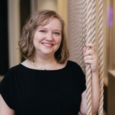

# Writing Portfolio

My first job was at 13 writing about rodeos and stick horse races, and I haven't stopped writing since. From journalism to academia to software documentation, I'm skilled in addressing multiple audiences, in multiple ways, using multiple technical skills and tools.

{ align=left }

I am currently the Lead Technical Writer for SaaS documentation at SailPoint Technologies in Austin, TX. I'm a vocal advocate for centering users' needs in product and doc decisions. I love a technical challenge and specialize in setting up docs-as-code systems and information architectures. I'm also passionate about mentoring, both at work and with volunteer organizations.

In addition to my writing experience, I excel at project development and cross-functional collaboration. I've launched multiple projects increasing the reach and engagement of product documentation with customers.

In my free time, I enjoy traveling, playing video games, cooking, mentoring youth, and learning new technologies. 

## Write the Docs 2025 Presentation

In May 2025, I spoke at Write the Docs Portland. My speech was titled [Quest for the Holy Grail: Turning User Feedback Into Meaningful Change](https://www.writethedocs.org/conf/portland/2025/speakers/#speaker-rachel-rigdon-quest-for-the-holy-grail-turning-user-feedback-into-meaningful-change-rachel-rigdon){:target="_blank"}.

??? "Expand to view abstract"

    **Quest for the Holy Grail: Turning User Feedback into Meaningful Change**

    One of the most frustrating experiences as a tech writer is hearing secondhand that a customer complained about the documentation—especially when it’s a nebulous complaint that leaves no clear path for improvement. Receiving quality user feedback is often seen as the Holy Grail of documentation: elusive, invaluable, and transformative. Yet, gathering relevant, actionable insights is an ongoing challenge.

    In June 2024, SailPoint embarked on a journey to address this challenge by adding a mechanism for users to provide feedback directly on our documentation pages.

    While implementing a comment option isn’t groundbreaking, this presentation will focus on what we discovered during our quest: the lessons about our value as tech writers, the priorities we identified in gathering user feedback, and how user engagement can drive meaningful improvements in both documentation and the product itself.

    Key takeaways include:

    - Building a Feedback System That Works: Learn the essential components needed to ensure your feedback mechanism encourages constructive input instead of becoming a pile of complaints.
    - Making Connections: Discover how fostering cross-functional teamwork and community building enhances the feedback-gathering process.
    - Adapting to Your Team’s Realities: Learn strategies for tailoring your feedback approach to fit your team’s constraints without sacrificing impact.
    - Amplifying User Voices: Understand how to ensure the right stakeholders hear and act on user concerns.
    - Demonstrating Your Value: Gain insights into showcasing how tech writers’ proximity to users strengthens product development.
    
    This talk is designed for anyone seeking to prioritize user feedback effectively and transform customer responses into actionable insights that elevate both documentation and the product experience.

<iframe width="560" height="315" src="https://www.youtube.com/embed/-1n2DEkN6Mk?si=eKYIZq6DAdM5als4" title="Quest for the Holy Grail: Turning User Feedback into Meaningful Change by Rachel Rigdon" frameborder="0" allow="accelerometer; autoplay; clipboard-write; encrypted-media; gyroscope; picture-in-picture; web-share" referrerpolicy="strict-origin-when-cross-origin" allowfullscreen></iframe>

## Writing Samples

You can view samples of my writing from:

- Actively maintained [Identity Security public documentation](id_security.md) from SailPoint Technologies
- [Anaconda](anaconda/index.md), the Python package distributor
- [CS Disco](disco.md), a legaltech startup
- [Southwestern University](academic.md#as-a-professor) as a professor
- [Northwestern University Graduate School](academic.md#as-a-student) as a student
